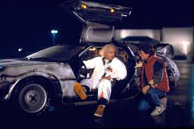

### inferência causal em estudos observacionais

---

### questões causais

- o diploma de ensino superior aumenta o salário?
- o BolsaFamília melhora o desempenho das crianças na escola?
- o PROUNI aumenta as chances de pessoas pobres terminarem o ensino superior?
- o Minha Casa Minha Vida diminui a violência doméstica?
- as UPPs reduziram a criminalidade?

---

### a política causa o efeito pretendido?

Efeito pretendido = variação na variável de interesse

---

### como responder se A causa B?

---

### dois métodos simples

- diferença entre participantes e não-participantes

- diferença entre participantes antes e depois

---

### comparar participantes e não participantes

---

### o ensino superior aumenta o salário?

- $salario\_{ES}$ - $salario\_{naoES}$

---

#### o problema das variáveis confundidoras

- ter ensino superior não é a única diferença entre beneficiários e não beneficiários
- p. ex., morar na zona rural, baixa escolaridade dos pais, rede de contato, filhos etc..
- a variação no salário pode ser causada por esses outros fatores.

### Comparar participantes antes e depois do programa

---

### o BICE aumenta o salário?

- $salario\_{antes} - salario\_{depois}$

---

### o problema das variáveis confundidoras

- ter feito o BICE não é a única diferença entre você antes e você depois.
- p. ex., ficou mais velho, fez mais contatos, o mercado de trabalho mudou etc.
- a variação do salário pode ser causada por esses outros fatores.

---

# A confusão entre correlação e causalidade

---

- pessoas que recebem o PBF têm mais filhos. Logo, o PBF faz as pessoas terem mais filhos.

---

sempre que há causação há correlação, mas nem sempre que há correlação há causação.

---

A causa B?

 
 

A melhor maneira de responder a esse tipo de questão é usar **experimentos controlados aleatorizados**.

---

- dados experimentais  =  estudos controlados aleatorizados

- controlados: grupo de tratamento vs grupo controle  

- aleatorizados (randomizados): dois passos
  - atribuição aleatória do tratamento (formação dos grupos)
  - seleção aleatória da amostra

---

### aleatório

- ao acaso, loteria, sorteio, não sistemático etc.
- não baseado em alguma característica dos elementos (idade, renda, partido etc.).
- objetivo: garantir que todas as observações tenham a mesma chance de serem selecionadas.

---

### por que formar grupos de maneira aleatória?
(atribuição aleatória do tratamento)

- para garantir que a média das características observadas e não-observadas dos elementos dos grupos sejam parecidas exceto pelo recebimento do tratamento.

 

- apenas a aleatorização pode controlar variáveis não-observadas

---

### por que usar um grupo controle?

 

Para identificar quanto da variação da variável de interesse foi causada pelo tratamento e quanto se deve a outros fatores.

---

Mas em políticas públicas é impossível, injusto ou muito difícil atribuir os tratamentos aleatoriamente.

---

**estudos experimentais**

- duas aleatorizações
- o pesquisador controla o tratamento

**estudos observacionais**

- aleatorização apenas da amostra
- o pesquisador não controla o tratamento   
(quem vai ser negro, ser obeso, ser mãe solteira etc.)

---

### solução

- transformar dados observacionais em dados experimentais.
- médias condicionais.

---

- passo inicial: análise de regressão

- problema: viés de seleção (tratamento não aleatório)

- pareamento
- diferenças em diferenças (diff em diff)
- variáveis instrumentais
- regressão descontínua

---

### modelo dos resultados potenciais

O impacto de um programa é a diferença causada por ele na variável de interesse entre duas situações:

- os participantes após terem participado  
(salário do Felipe depois de ter feito o BICE)

- os participantes se não tivessem participado  
(salário do Felipe se não tivesse feito o BICE)

---

mas há apenas um Felipe e ele fez o BICE

---

### Quatro situações possíveis

 

$ E[Y^1 | D=1] $ – tratados tendo sido tratados (**observado**)  
$ E[Y^0 | D=1] $ – tratados se não fossem tratados (hipotético)
$ E[Y^0 | D=0] $ – não tratados sem ter sido tratado (**observado**)  
$ E[Y^1 | D=0] $ – não tratados se tivessem sido tratados (hipotético) 

---

### o ideal

uma máquina do tempo

 

---

 

---

### solução

- usar pessoas que não receberam o tratamento e sejam parecidas com quem recebeu como substitutas do futuro alternativo.

- é preciso garantir que eles sejam parecidos

- esse é o objetivo da aleatorização do tratamento no caso dos estudos experimentais
