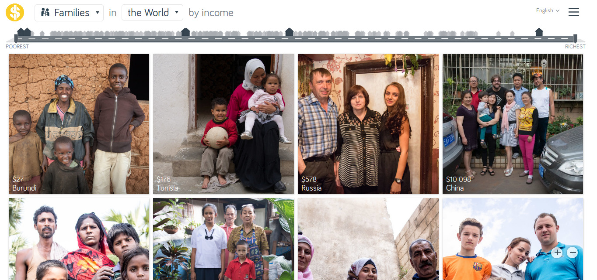
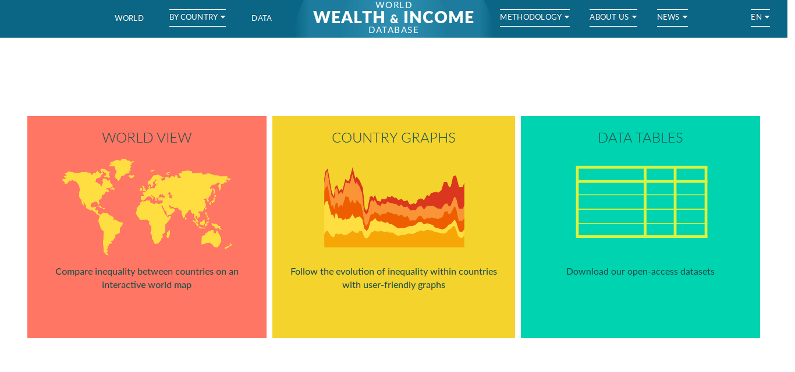

### A desigualdade social como problema
Lincoln Frias

---

### A rua do dinheiro

[www.gapminder.org/dollar-street](www.gapminder.org/dollar-street)

 

---

### Definição

 

**Desigualdade social**: parcelas da população possuem quantidades diferentes de coisas boas (ou ruins).

 

 **Coisas**: renda, riqueza, educação, segurança, saúde, poder, direitos etc.

---

A desigualdade pode ser multidimensional.

 

Exemplos:   
- entre pessoas de mesma renda, negros e pardos são tratados de maneira pior.    
- entre pessoas de mesma cor, mulheres são tratadas de maneira pior.
    

---

Desigualdade e pobreza são acontecimentos independentes.

 

- pode haver pobreza sem desigualdade    
(todos podem ser pobres - Etiópia, interior do Amazonas)    
- pode haver desigualdade sem pobreza    
(os ricos são muito mais ricos do que a classe média - EUA)   
- mas também podem acontecer juntos    
(Brasil)

---

Nem toda desigualdade é errada   

---

#### Quando a desigualdade é errada?

 

- quando é **injusta**: quando não é resultado do mérito/esforço.   
Quando as pessoas são prejudicadas/beneficiadas independentemente de suas ações: nascer pobre ou doente, não conseguir o emprego porque é mulher etc..   

 

- quando é **ruim**: mesmo a desigualdade justa pode ter efeitos ruins.   
Quando há acúmulo de vantagens (na família, em uma cidade, em uma empresa), especialmente a concentração de poder (Globo, Barcelona).

---

**Igualdade de oportunidades ou de resultados**?

 

- resultados desiguais quando houve oportunidades iguais são injustos?  
- responsabilidade: o que fazer com o vagabundo mendigo e o fumante doente?  
- a disposição para o trabalho não está completamente sob o controle dos indivíduos (pais e escolas ruins etc.).  
- equidade: a justiça é tratar os desiguais de maneira desigual (na medida da sua desigualdade). Exigente demais? Como medir?

---

World Wealth & Income Database  
[wid.world](wid.world)    

